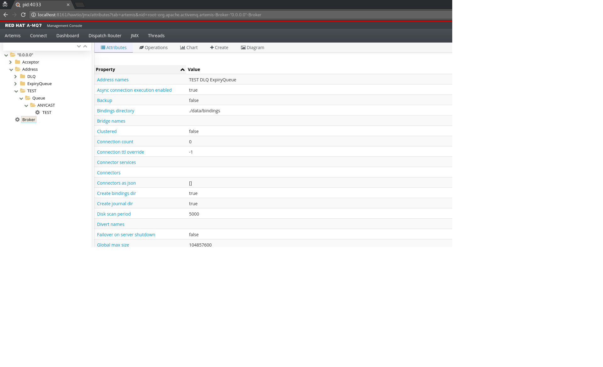
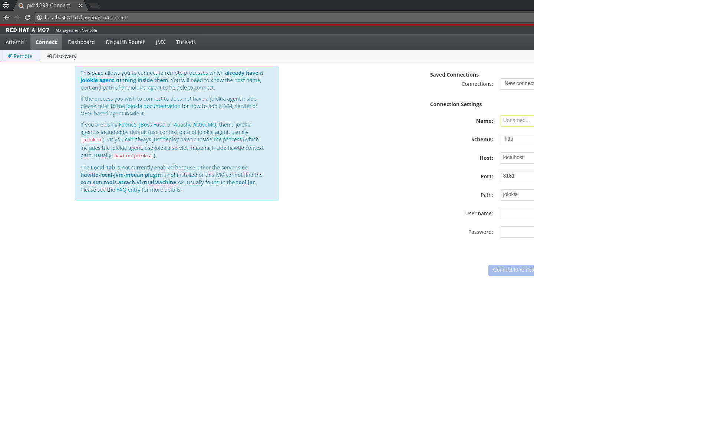

# Artemis HawtIO plugin

## deploying the plugin

### Embedded

Since Artemis ships with a Web Server add the HawtIO war and the plugin to the bootstrap.xml configuration file like:

```xml
<app url="hawtio" war="hawtio-web.war"/>
<app url="artemis-plugin" war="artemis-plugin.war"/>
```

and place each war into the web directory.

you will also need to configure credentials for logging into HawtIO. When you create an instance of Artemis you will be 
prompted for a default user and role. To use this for the hawtIO login credentials update the `JAVA_ARGS` property in the
`artemis.profile` configuration file and add the default role, so if you set the default role as `admin` then add the following.

```bash
-Dhawtio.realm=activemq -Dhawtio.role=admin -Dhawtio.rolePrincipalClasses=org.apache.activemq.artemis.spi.core.security.jaas.RolePrincipal
```

Alternatively add a new user/role into the `artemis-users.properties` and `artemis-roles.properties` files respectively.

### standalone

To deploy standalone refer to the HawtIO documentation on installing plugins. for e

## Logging in to the Artemis console

###Embedded

If you are using the default artemis configuration then simple go to [http://localhost:8161/hawtio/login](http://localhost:8161/hawtio/login)
and then log in using the credentials you configured above. You will the see an Artemis tab displayed, if you click on
this you should see:



###standalone

If you have installed HawtIO standalone and want to connect to a remote broker you will need to connect to it by clicking 
on the connect tab and entering the Jolikia path, like so:



##The JMX tree

When on the Artemis tab on the left you will see a sanitized version of the Artemis JMX tree. This is the entry point into
the extra functionality that the Artemis HawtIO plugin gives you as well as the the usual JMX attributes and Operations.
To view the full JMX tree simple click on the JMX tab.

##Creating a Queue

To Create a new JMS Queue simply click on the `Queue` folder in the JMX tree and on the `create` tab, enter the name of
the queue you want to create and then click on `Create queue`` like so:


Alternatively if the `Queue` folder isn't showing click on the `Server` folder in the JMX tree and on the `create` tab, 
choose the `queue` option and click on `Create queue`` like so:


##Creating a topic

Creating a topic is exactly the same as Creating a Queueexcept you either click on the `topic` folder in the JMX tree or
 choose the `topic` option when using the server option.
 
##Sending a message to a Queue

Sometimes it is desirable to test an installation by sending a test message or to simply just send a message. To do this 
choose the Queue from the JMX tab that you want to send the message to and click on the `send` tab. Fill in the message
 content and any headers and click on the 1Send Message` button, like so:
 
 

##Browsing a Queue for messages

It is also possible to browse a queue and inspect the messages in that Queue, to do this click on the Queue you want to 
browse in the JMX tree and click on the `browse` tab. you will see the first 200 messages by default that are in the queue,
 something like:
 
 
 


> **Note**
>
> The default of 200 messages can be configured in Artemis on the Address Settings by configuring `management-browse-page-size`
 
It is also possible to look at the message content by clicking on the message ID of the message you want to view, you will
then see something like:


This screen will allow you to iterate over the browsed messages using the casette buttons and also move or delete the messages.

###Deleting Messages
 
It is possible to delete 1 or more messages by choosing the messages in thr browse screen and then clicking the `delete` 
button in the top right.

###Moving Messages

It is possible to move a single message from 1 Queue to another by clicking on the `move` button in the top right and then
entering the Queue that you would like to move it to

###Resending Messages

It is possible to resend a message as a new message by simply clicking on the `resend` button in the top right hand which 
will take you to the send screen.

##The Broker Diagram

The Broker Diagram shows a visualisation of all the resources in an Artemis Topology including Brokers (master and slave),
queues, topics and consumers. To view the diagram simply click on the `Diagram` tab and you will see something like:


To control what appears on the diagram simply click on the `view` drop down in the top right hand corner and choose what 
you want to appear. these include:

<table summary="Available Diagram Resources" border="1">
    <colgroup>
        <col/>
        <col/>
    </colgroup>
    <thead>
    <tr>
        <th>Resource</th>
        <th>Description</th>
    </tr>
    </thead>
    <tbody>
    <tr>
        <td>`Consumers`</td>
        <td>All the Consumers connected</td>
    </tr>    
    <tr>
        <td>`Producers`</td>
        <td>All the Producers connected (currently not supported)</td>
    </tr>
    <tr>
        <td>`Queues`</td>
        <td>All the Queues that have consumers connected</td>
    </tr>
    <tr>
        <td>`Topics`</td>
        <td>All the Topics that have consumers connected</td>
    </tr>
    <tr>
        <td>`All Queues`</td>
        <td>All the Queues</td>
    </tr>
    <tr>
        <td>`Topics`</td>
        <td>All the Topics</td>
    </tr>
    <tr>
        <td>`Brokers`</td>
        <td>All the Master Brokers in the current VM</td>
    </tr>
    <tr>
        <td>`Slave Brokers`</td>
        <td>All Slave Brokers in the current VM</td>
    </tr> 
    <tr>
        <td>`Network`</td>
        <td>All the remote Brokers if the broker type is chosen above</td>
    </tr>
    <tr>
        <td>`Details Panel`</td>
        <td>Info about the highlighted resource shown on the right</td>
    </tr> 
    <tr>
        <td>`Hover Text`</td>
        <td>Extra info shown when hovering over the resource</td>
    </tr>
    <tr>
        <td>`Label`</td>
        <td>Adds a label to the resource</td>
    </tr>
    </tbody>
</table>

##Preferences

There are some preferences that are needed for certain screens, these can be set by using the user drop down box in the 
top right hand corner and choosing the `preferences` option and clicking on the `artemis` tab. The options available are:
 
 
<table summary="Available Diagram Resources" border="1">
    <colgroup>
        <col/>
        <col/>
    </colgroup>
    <thead>
    <tr>
        <th>Resource</th>
        <th>Description</th>
    </tr>
    </thead>
    <tbody>
    <tr>
        <td>`User name`</td>
        <td>The user name used for security when sending messages etc</td>
    </tr>    
    <tr>
        <td>`Password`</td>
        <td>The password used for security when sending messages etc</td>
    </tr> 
    <tr>
        <td>`DLQ`</td>
        <td>The name of the dead letter queue, this will expose a `retry` button when browsing the queue to allow retying the message send</td>
    </tr>    
    <tr>
        <td>`ExpiryQueue`</td>
        <td>The name of the expiry queue, this will expose a `retry` button when browsing the queue to allow retying the message send</td>
    </tr>    
    <tr>
        <td>`Browse byte messages`</td>
        <td>How bytes messages should be viewed when browsing a Queue</td>
    </tr>       
    </tbody>
</table>
 
 


